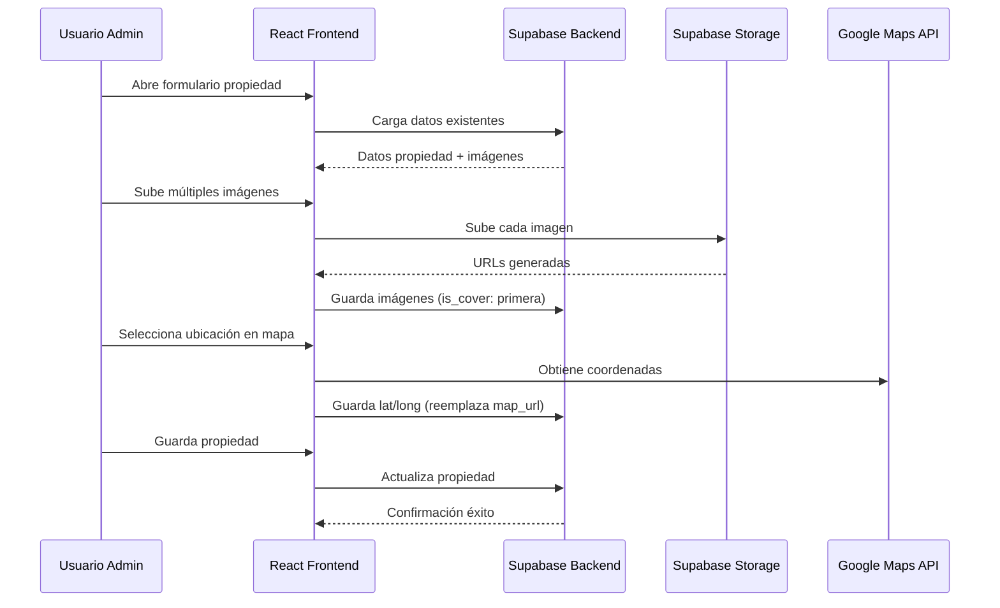

# Design Document: Property Module Improvements

## Overview

Mejoras al módulo de propiedades para soportar múltiples imágenes y mapa interactivo. El sistema actual ya tiene estructura de base de datos para múltiples imágenes (tabla `property_images` con `is_cover`), pero el frontend solo maneja una imagen principal. También existe un campo `map_url` que debe ser reemplazado por un mapa interactivo con latitud/longitud.

## Main Algorithm/Workflow



## Core Interfaces/Types

```typescript
// Tipos existentes extendidos
interface PropertyImage {
  id: string;
  property_id: string;
  url: string;
  storage_path: string | null;
  is_cover: boolean;
  sort_order: number;
  created_at: string;
}

interface Property {
  id: string;
  title: string;
  // ... otros campos existentes
  map_url: string | null;  // DEPRECADO - mantener para compatibilidad
  latitude: number | null;  // NUEVO
  longitude: number | null; // NUEVO
  images: PropertyImage[];  // Relación cargada
}

// Form state para múltiples imágenes
interface PropertyFormState {
  // Campos existentes...
  images: Array<{
    id?: string;           // Para imágenes existentes
    file: File | null;     // Para nuevas imágenes
    url: string;           // URL de preview o existente
    isCover: boolean;      // Imagen principal
    order: number;         // Orden de visualización
  }>;
  latitude: number | null;
  longitude: number | null;
  address: string;         // Para geocodificación inversa
}

// Configuración del mapa
interface MapConfig {
  center: { lat: number; lng: number };
  zoom: number;
  apiKey: string;
  provider: 'google' | 'leaflet';
}
```

## Key Functions with Formal Specifications

### Function 1: uploadPropertyImages()

```typescript
async function uploadPropertyImages(
  propertyId: string,
  images: Array<{ file: File; isCover: boolean; order: number }>
): Promise<PropertyImage[]>
```

**Preconditions:**
- `propertyId` es un UUID válido de propiedad existente
- `images` array no vacío (mínimo 1 imagen)
- Cada `file` es válido: tipo JPG/PNG/WEBP, tamaño ≤ 10MB
- Exactamente una imagen tiene `isCover: true`

**Postconditions:**
- Retorna array de `PropertyImage` creadas
- Imagen con `isCover: true` se guarda como portada
- Todas las imágenes se suben a Supabase Storage
- Se mantiene integridad referencial con propiedad
- No side effects en imágenes existentes no modificadas

**Loop Invariants:** 
- Para cada iteración de subida: todas las imágenes anteriores se subieron exitosamente
- Estado de storage permanece consistente durante proceso batch

### Function 2: updatePropertyLocation()

```typescript
async function updatePropertyLocation(
  propertyId: string,
  coordinates: { latitude: number; longitude: number },
  address?: string
): Promise<void>
```

**Preconditions:**
- `propertyId` es UUID válido de propiedad existente
- `coordinates.latitude` ∈ [-90, 90]
- `coordinates.longitude` ∈ [-180, 180]
- Coordenadas representan ubicación válida (no en medio del océano)

**Postconditions:**
- Campos `latitude` y `longitude` actualizados en BD
- Campo `address` actualizado si se proporciona
- Campo `map_url` se mantiene para compatibilidad (puede ser null)
- No afecta otros campos de la propiedad
- Transacción atómica: todo o nada

### Function 3: validateImageFiles()

```typescript
function validateImageFiles(
  files: File[],
  options?: { maxCount?: number; maxSizeMB?: number }
): ValidationResult
```

**Preconditions:**
- `files` es array de objetos File
- `options.maxCount` ≥ 1 si se proporciona
- `options.maxSizeMB` ≥ 0.1 si se proporciona

**Postconditions:**
- Retorna `{ valid: boolean; errors: string[] }`
- `valid: true` si todos los archivos cumplen:
  - Tipos MIME: image/jpeg, image/png, image/webp
  - Tamaño ≤ (options.maxSizeMB || 10) MB
  - Cantidad ≤ (options.maxCount || 20)
- `valid: false` si algún archivo no cumple, con errores descriptivos
- No modifica los archivos

**Loop Invariants:**
- Para cada archivo validado: estado de validación anterior permanece
- Acumulación de errores es determinística

## Algorithmic Pseudocode

### Main Image Processing Algorithm

```pascal
ALGORITHM processPropertyImages(propertyId, imageFiles)
INPUT: propertyId (UUID), imageFiles (Array<File>)
OUTPUT: Array<PropertyImage>

BEGIN
  ASSERT propertyId IS VALID UUID
  ASSERT imageFiles.length ≥ 1
  
  // Validar archivos
  validation ← validateImageFiles(imageFiles, { maxCount: 20, maxSizeMB: 10 })
  IF NOT validation.valid THEN
    THROW ValidationError(validation.errors)
  END IF
  
  // Procesar en batch
  uploadedImages ← []
  
  FOR i FROM 0 TO imageFiles.length - 1 DO
    ASSERT allPreviousUploadsSuccessful(uploadedImages)
    
    file ← imageFiles[i]
    isCover ← (i = 0)  // Primera imagen es portada
    
    // Subir a storage
    uploadResult ← uploadToSupabaseStorage(file, 'property-images')
    
    // Guardar metadata en BD
    imageRecord ← createPropertyImageRecord(
      propertyId,
      uploadResult.url,
      uploadResult.storagePath,
      isCover,
      i
    )
    
    uploadedImages.add(imageRecord)
  END FOR
  
  // Verificar que exactamente una es portada
  coverCount ← COUNT(image IN uploadedImages WHERE image.is_cover = TRUE)
  ASSERT coverCount = 1
  
  RETURN uploadedImages
END
```

**Preconditions:**
- propertyId referencia propiedad existente
- imageFiles contiene al menos un archivo válido
- Usuario tiene permisos para modificar la propiedad
- Conexión a Supabase disponible

**Postconditions:**
- Todas las imágenes subidas a storage
- Metadata guardada en tabla property_images
- Exactamente una imagen marcada como is_cover
- Orden de visualización preservado
- Transacción atómica: si falla una, rollback completo

**Loop Invariants:**
- uploadedImages mantiene consistencia con storage
- isCover asignado correctamente (solo primera imagen)

### Interactive Map Selection Algorithm

```pascal
ALGORITHM handleMapSelection(mapEvent, currentProperty)
INPUT: mapEvent (MapClickEvent), currentProperty (Property | null)
OUTPUT: coordinates { latitude, longitude }

BEGIN
  // Obtener coordenadas del click
  lat ← mapEvent.latLng.lat()
  lng ← mapEvent.latLng.lng()
  
  // Validar coordenadas geográficas
  ASSERT lat ≥ -90 AND lat ≤ 90
  ASSERT lng ≥ -180 AND lng ≤ 180
  
  // Geocodificación inversa (opcional)
  IF mapEvent.reverseGeocode THEN
    address ← reverseGeocode(lat, lng)
  ELSE
    address ← currentProperty?.address OR ''
  END IF
  
  // Actualizar UI
  UPDATE mapMarkerPosition(lat, lng)
  UPDATE addressField(address)
  
  // Preparar datos para guardar
  coordinates ← { latitude: lat, longitude: lng }
  
  RETURN coordinates
END
```

**Preconditions:**
- mapEvent contiene coordenadas válidas
- API de mapa inicializada y funcionando
- Usuario tiene permisos para modificar propiedad

**Postconditions:**
- Marcador actualizado en posición seleccionada
- Campo de dirección actualizado (si geocodificación exitosa)
- Coordenadas validadas y listas para guardar
- No side effects en otros campos del formulario

## Example Usage

```typescript
// Ejemplo 1: Subida múltiple de imágenes
const handleImageUpload = async (propertyId: string, files: File[]) => {
  try {
    const images = await uploadPropertyImages(propertyId, files);
    console.log(`${images.length} imágenes subidas`);
    
    // Actualizar UI
    setPropertyImages(images);
    showToast('Imágenes guardadas exitosamente', 'success');
  } catch (error) {
    showToast(`Error: ${error.message}`, 'error');
  }
};

// Ejemplo 2: Selección de ubicación en mapa
const handleMapClick = (event: google.maps.MapMouseEvent) => {
  if (!event.latLng) return;
  
  const lat = event.latLng.lat();
  const lng = event.latLng.lng();
  
  // Validar coordenadas
  if (lat < -90 || lat > 90 || lng < -180 || lng > 180) {
    showToast('Coordenadas inválidas', 'error');
    return;
  }
  
  // Actualizar estado del formulario
  setForm(prev => ({
    ...prev,
    latitude: lat,
    longitude: lng
  }));
  
  // Opcional: geocodificación inversa
  reverseGeocode(lat, lng).then(address => {
    setForm(prev => ({ ...prev, address }));
  });
};

// Ejemplo 3: Validación antes de guardar
const validateBeforeSave = (form: PropertyFormState) => {
  const errors: string[] = [];
  
  // Validar imágenes
  if (form.images.length === 0) {
    errors.push('Se requiere al menos una imagen');
  }
  
  const coverCount = form.images.filter(img => img.isCover).length;
  if (coverCount !== 1) {
    errors.push('Debe haber exactamente una imagen principal');
  }
  
  // Validar ubicación
  if (form.latitude === null || form.longitude === null) {
    errors.push('Debe seleccionar una ubicación en el mapa');
  }
  
  return {
    valid: errors.length === 0,
    errors
  };
};
```